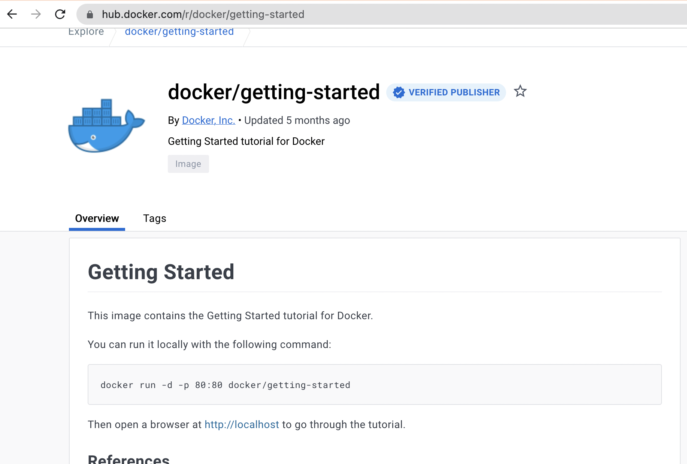
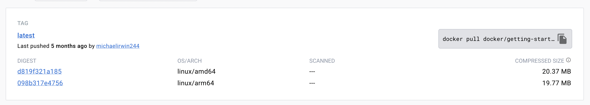
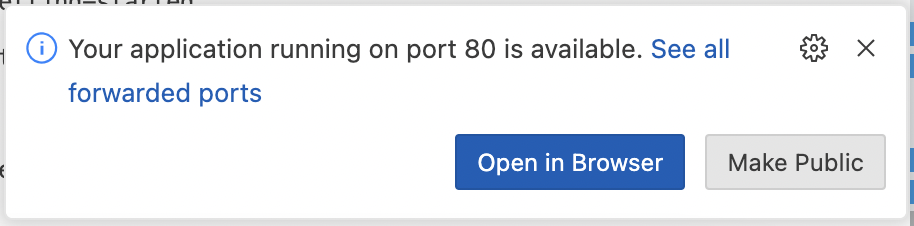
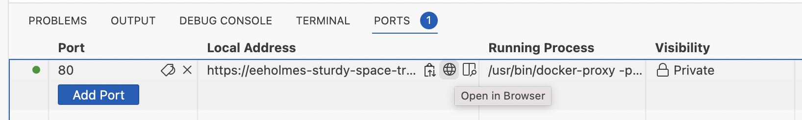
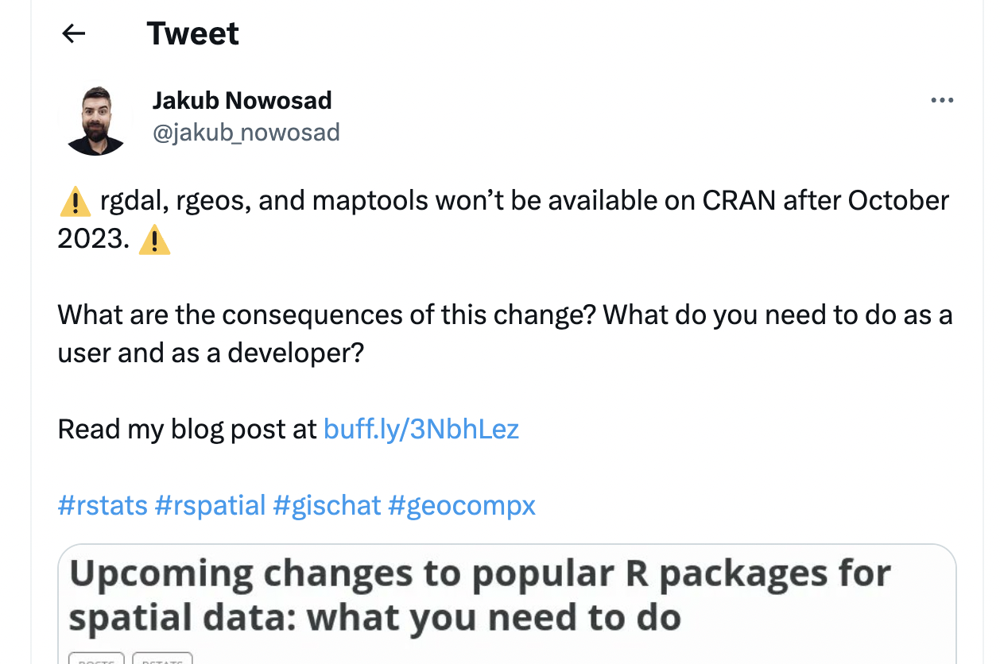

<!--
for Mac users on Apple chip
https://levelup.gitconnected.com/docker-on-apple-silicon-mac-how-to-run-x86-containers-with-rosetta-2-4a679913a0d5
-->

```{r setup, include=FALSE}
knitr::opts_chunk$set(echo = TRUE)
set.seed(1234)
```

# Intro to containers

I labelled this lecture "Intro to Docker", because Docker and Docker files or images is what you will have heard about. However, the content is more generally about "containers" for running applications. The Docker engine is a very common way to run these application containers, but there are other ways to run them.

*I am not allowed to install Docker on my computer.* This is a common restriction for government computers due to a security risk with Docker allowing root access on your computer. I will also show [Podman](https://podman.io/), which is more secure and more likely to be allowed.

*Do I have to install something for this lecture?* No. I am also showing the content with GitHub Codespaces, which is free.

# What is Docker?

ChatGPT says: *Docker is an open-source platform that allows you to automate the deployment and management of applications within software containers. It provides a way to package software and its dependencies into a standardized unit called a container. These containers are lightweight, portable, and self-sufficient, containing everything needed to run the application, including the code, runtime, system tools, libraries, and settings.*

{width=50%}


Today I will show Docker using GitHub Codespaces since Docker Desktop requires a license for use on government computers and also Docker can allow root access to your computer so needs a special set-up for organizations that don't allow root access.

# Open a Docker image on a Codespace

## Let's run the Docker tutorial image

{width=20px} [Video of this step](https://youtu.be/ZUCHhflSWpQ)


Before we run a random container, let's take a look at the image that we will be using: https://hub.docker.com/r/docker/getting-started

{width="800"}

Click on tags

{width="800"}

You can follow the links on the DockerHub page to get more info.


## Open a GitHub Codespace

1. Go to any GitHub repo. It really doesn't matter which, we just want the Code tab. For example, go here: https://github.com/RVerse-Tutorials/Test
2. Click the 'Code' button, then click Codespace tab, and then click 'Open codespace on main'.

## Let's run a container

When your container spins up, you want to go to the terminal tab. Once there, run this code to start the Docker tutorial app:

```         
docker run -d -p 80:80 --name test docker/getting-started
```

-   `docker` call Docker
-   `run` run a container
-   `-d` in detached setting
-   `-p` use this port (first number) and listen on second port.
-   `--name` give the container a name (for convenience)
-   `docker/getting-started` the name of the container on DockerHub


### Why is the port listed twice?

It's not exactly. In `80:80`, the second `#` is the port that the application is listening under and your application documentation should tell you if it is listening on a specific port (or look in the Dockerfile for a line like `EXPOSE 80`). The first one is the port you want to use in your browser. So we could do `8181:80` and go to our app on port `8181`. 

The first time it'll download the container. Once it is done, we can see the running container in the ports tab or run 

```
docker ps
```

in the terminal to see the running container.


### Now we can open our app

When you run the code above, you will (likely) see a pop-up like so, but I have often had trouble opening my applications via 'open in browser'. So I close that pop-up.



Instead, I go to the ports tab and click the little world icon next to my application to open the port in a browser. The little world icon is quite hidden; you need to roll over the application link.


Now your application will open in your browser. *It didn't!* Just reload the page.

## Run RStudio within a Codespace

{width=20px} [Video of this step](https://www.youtube.com/watch?v=bzvDaQTqgLg)

The [Rocker Project](https://rocker-project.org/) makes Docker [images](https://rocker-project.org/images/) for running R and RStudio. Let's spin up RStudio within Codespaces.

Go back to the terminal (in your Codespace). From the Rocker Project page, it says to run this to open RStudio:

```
docker run --rm -ti -d -e PASSWORD=yourpassword -p 8787:8787 rocker/rstudio
```

`--rm` means to remove the container when we stop it. `-ti` means interactive mode with a pseudo-tty. This is not needed but gives some log output. `-e` sets the password for our RStudio server. Username will be `rstudio`. `-p` is the ports. The second # (after `:`) is set by the image and needs to be `8787`. The first is up to you. Set to whatever (is open).

Note, most of those flags are not needed. This works fine. The `-d` is handy just so you get back to the command line after running the command.

```
docker run -d -e PASSWORD=yourpassword -p 8787:8787 rocker/rstudio
```

As before, go to the ports tab, roll over the local address and click on the globe icon to open. Then login into RStudio with user name `rstudio` and password `yourpassword`. Note you can use the variable `DISABLE_AUTH=true` to disable the login feature:

```
docker run -d -e DISABLE_AUTH=true -p 8787:8787 rocker/rstudio
```

## Connecting RStudio to GitHub

You can now work on code in your RStudio instance, but it is in a container that will disappear (along with your files) as soon as you stop the codespace. And the codespace will stop on its own after inactivity so you definitely want to save your files.

Let's walk through linking your RStudio instance to a GitHub repo.

1.  Create a project from a repo

    Click the project tab in upper right and then create project using a GitHub repo URL.

2. Tell Git who you are

    Open the terminal tab in the bottom right panel and run this code (replacing the dummy values):

    ```
    git config --global user.name "Your Name"
    git config --global user.email "your@email.com"
    ```

3. Tell Git to store your authentication info

    ```
    git config --global credential.helper store
    ```

4. Create a Personal Access Token on GitHub

    Go to your GitHub account, scroll down to Settings. Then scroll down on left to Developer settings. Then go to Personal access tokens and then classic tokens. Generate a classic token with the repo scope (you only need repo). Copy the token that is generated.
    
5.  Make a change, commit and push.

    You will be asked for your username and password. Use the Personal access token as your password.
    
Now you can push changes to your GitHub repository.

## Using a versioned rocker image

The June 2023 announcement of the retirement of popular spatial packages in R is a good example of when the versioned rocker images are useful.



If we don't want to update our code but it uses R packages that have been retired, we can use Docker to open a version of R and **a snapshot of the R packages at that time**.

### Let's spin up a R 4.1 container

```         
docker run \
  -d \
  -p 8181:8787 \
  -e USER=test \
  -e PASSWORD=test \
  --name geospatial \
  rocker/geospatial:4.1
```

Once this is ready on port 8181, you can open RStudio with R 4.1 and the now expired geo R packages.


# Running containers on your computer

In this section, I will run the Rocker images on my local computer. For this you need either Docker Desktop or Podman installed.

**Why would you want to do this?** 

* Let's say you want to run some code that relies on say Python, a bunch of Python packages, some extra software package and Jupyter Notebooks...and you have none of these installed. This is a nightmare situation, especially if you cannot install software on your computer. But with Docker (or Podman) installed, you will be up and running with a fully functional development environment in a couple minutes without installing any software on your computer.
* Or let's say you need to run an older version of R with older/archived R packages such as the rgdal package. Docker images will allow that for you easily.

**Heads up for Mac users** If you are on a Mac with an Apple chip (so M1, M2, etc), you need to check if there is `linux/arm64` listed for the image you are using:

{width="800"}

This means there is a version of the container that will work on your architecture (Apple chip). If you only see `linux/amd64`, you can try emulation but it might not work. To increase success, make sure you have a recent version of Docker Decktop installed. To run in emulation mode (Rosetta), you add this to your `docker run` call: `--platform linux/amd64`. If you have MacOS 12.5+, then click the Virtualization Framework setting under Settings in Docker Desktop. See [this](https://levelup.gitconnected.com/docker-on-apple-silicon-mac-how-to-run-x86-containers-with-rosetta-2-4a679913a0d5) info and [this](https://github.com/rocker-org/rocker-versioned2/issues/144) specific to Rocker images.

*Note*, there is a fatal error for M1 Macs with older MacOS versions that will cause Docker Desktop to fail to open if you check the Virtualization Framework setting. Once that happens, you can't uncheck it that so that Docker opens again (because you can't get to Docker Desktop). If that happens, first go to Activity Monitor and force quit Docker and Docker Desktop. Then you have two options: 1) uninstall and reinstall Docker Desktop or 2) type `open ~/Library/Group\ Containers/group.com.docker/settings.json` in a terminal and look for the line `"useVirtualizationFramework": true,` and change that to `"useVirtualizationFramework": false,`.

## Install a way to run containers

* [Docker Desktop](https://www.docker.com/products/docker-desktop/) If you are on a managed computer (e.g. government), you might not be able to install Docker due to a security risk associated with Docker running containers as root user. Also Docker Desktop requires a license ($) if you are using on a government computer.

**Heads up Windows users** You need root access to install and you need to add your user name to the `docker-users` group. You may need to install WSL2. You'll know because it will complain. You may need to uninstall and reinstall and restart a few times. So make sure you have someone with root access helping you.

**Important!** I am showing `docker` commands from the terminal, but I started Docker Desktop first which starts the docker service. If I had not done this, I would get an error regarding the docker daemon not running.

* [Podman](https://podman.io/) is a more secure option since it does not run containers as root by default. Your organization is more likely to allow Podman.

## Run Rocker containers

Running containers on your local computer is just like (mostly) running containers on your local computer with Docker or Podman. I can start containers with either the desktop app or from a terminal.

**Important!** You have to start the "daemon" before you can run containers using commands in a terminal window. The easy way to do this (without having to remember commands) is to just open the desktop app before you start trying to run commands from the terminal.

### Docker

{width=20px} [Video opening rocker/rstudio from terminal](https://youtu.be/fv4i0rDcr0s)

You can run containers either from the desktop app or from the terminal. In the video I run this code

```         
docker run \
  -d \
  -p 8787:8787 \
  -e USER=test \
  -e PASSWORD=test \
  rocker/rstudio:latest-daily
```

Then I open my RStudio server from a browser with `http://localhost:8787` (not `https` but `http`) and login as user "test" with password "test". I could use `-e DISABLE_AUTH=true` and remove the `-e USER=test` and `-e PASSWORD=test` parts to turn off the login page.

**Note** 1) If running from the terminal, make sure to open Docker Desktop first to start the docker daemon otherwise you'll get an error about the daemon not running. 2) The rocker apps are listening on port 8787, so make sure the number after the `:` is 8787. The first number is what you will use in the browser. So if you did `8080:8787`, then go to `http://localhost:8080` in your browser (not `https` but `http`) .


### Podman

Running containers with Podman is basically the same, but an important thing to know about Podman is that it replaces the USER variable with "root". It doesn't matter if you pass in `-e USER=something`; it is going to delete that. So you have to log into the RStudio server with "root" as the user.

{width=20px} [Video of running with Podman Desktop](https://youtu.be/Ll4apwgBs_g)

The video shows me running a container using the Podman Desktop app. I can also run this command from a terminal and do the same thing I did from the desktop app.

```
podman run -d -e PASSWORD=test -p 8787:8787 rocker/rstudio:latest
```

I open the app by going to `http://localhost:8787` (not `https` but `http`) and logging in as user "root" and password "test" (since I passed in the environment variable for password with `-e PASSWORD=test`).

## Using a versioned rocker image

## Let's spin up a R 4.1 container

Here is the command to open a R 4.1 container for rocker/geospatial if say we needed the archived geo packages (rgdal, etc).

```         
docker run \
  -d \
  -p 8181:8787 \
  -e USER=test \
  -e PASSWORD=test \
  --name geospatial \
  rocker/geospatial:4.1
```

MacOS users with Apple M2 chip read [this thread](https://levelup.gitconnected.com/docker-on-apple-silicon-mac-how-to-run-x86-containers-with-rosetta-2-4a679913a0d5) and [this thread](https://github.com/rocker-org/rocker-versioned2/issues/144) for how to run with Rosetta emulation. Basically you need Ventura and the latest version of Rosetta which you can get with `softwareupdate --install-rosetta`. If you have the M1 chip and MacOS < 12.5, you may be out of luck until an arm64 image is released by Rocker. I was unable to get the Rocker `amd64` images (like geospatial) to connect to the R server on an M1 Mac with BigSur.

```         
docker run --platform linux/amd64 \
  -d \
  -p 8181:8787 \
  -e USER=test \
  -e PASSWORD=test \
  --name geospatial \
  rocker/geospatial:4.1
```

