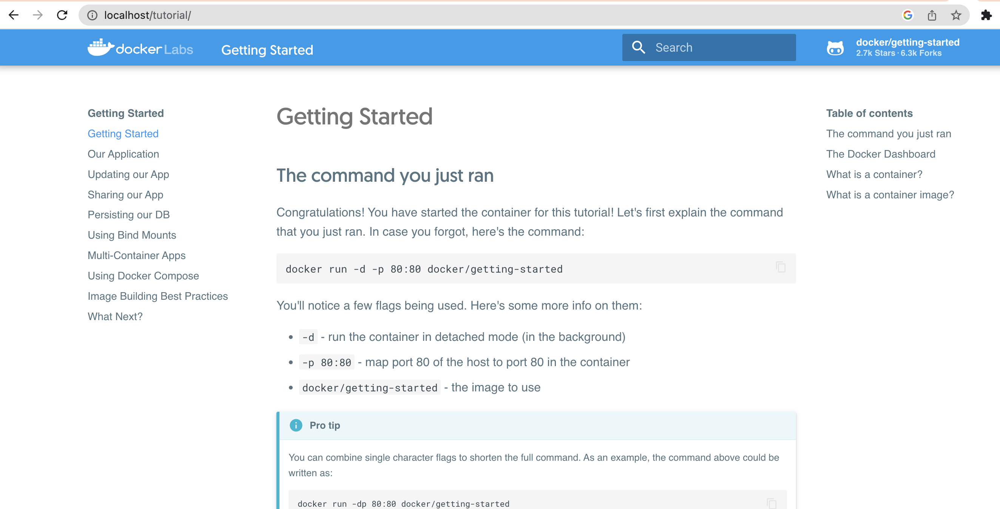

<!--
for Mac users on Apple chip
https://levelup.gitconnected.com/docker-on-apple-silicon-mac-how-to-run-x86-containers-with-rosetta-2-4a679913a0d5
-->

```{r setup, include=FALSE}
knitr::opts_chunk$set(echo = TRUE)
set.seed(1234)
```

# What is Docker?

ChatGPT says: *Docker is an open-source platform that allows you to automate the deployment and management of applications within software containers. It provides a way to package software and its dependencies into a standardized unit called a container. These containers are lightweight, portable, and self-sufficient, containing everything needed to run the application, including the code, runtime, system tools, libraries, and settings.*


## Install Docker

When working with virtual machines (VM) (think say Codespaces), a dockerfile is what defines our virtual environment and the tools (software) that we'll have in that environment. The systems that set-up your VM have docker installed.

Today I will show Docker using GitHub Codespaces since Docker Desktop requires a license for use on government computers and also Docker can allow root access to your computer so needs a special set-up for organizations that don't allow root access.

# Open a Codespace

1. Go here https://github.com/RVerse-Tutorials/Test
2. Click 'Code' tab and then open Codespace

# Let's run a container

Part 1 [Video](https://youtu.be/pQT_ybXoJtI)

After you have Docker installed, you can run a container.

```         
docker run -d -p 80:80 --name test docker/getting-started
```

-   `docker` call Docker
-   `run` run a container
-   `-d` in detached setting
-   `-p` use this port so `http://localhost:80` is how you open the application in a browser
-   `--name` give the container a name
-   `docker/getting-started` the name of the container on DockerHub


### Why is the port listed twice?

It's not exactly. In `80:80`, the second `#` is the port that the application is listening under and your application documentation should tell you if it is listening on a specific port. The first one is the port you want to use in your browser. So we could do `8181:80` and go to our app with `localhost:8181`.

## Let's take a look at the image

Before we blinding run a container, let's take a look at it.

{width="800"}

Click on tags

{width="800"}

If you are on a Mac with an Apple chip (so M1, M2, etc), you need to check if there is `linux/arm64` listed. This means there is a version of the container that will work on your operating system. If you only see `linux/amd64`, you can try emulation but it might not work. To increase success, make sure you have a recent version of Docker installed. To run in emulation mode (Rosetta), you add this to your `docker run` call: `--platform linux/amd64`.

## Run the container

Open a terminal (or shell) window on your computer, and type or paste this in:

```         
docker run -d -p 80:80 --name test docker/getting-started
```

The first time it'll download the container. Once it is done, we can see the running container in the Docker app or run 

```
docker ps
```

in the terminal to see the running container.


## Now we can open our app

Head to ports tab and click the little world icon to open the port in a browser.

## Aside: Docker Desktop

I am going to run the same command on my laptop so you can see how to open the container on your personal computer.

```         
http://localhost:80
```

 


# Rocker docker images

Part 2 [Video](https://youtu.be/fv4i0rDcr0s)

<https://jsta.github.io/r-docker-tutorial/02-Launching-Docker.html>

Note the rocker apps are listening on port 8787, so make sure the number after the `:` is 8787. The first number is what you will use in the browser. So if you did `8080:8787`, then go to `localhost:8080`.

```         
docker run --rm -ti -e PASSWORD=test -p 8787:8787 --name test2 rocker/rstudio
```


## Using a versioned rocker image

The June 2023 announcement of the retirement of popular spatial packages in R is a good example of when the versioned rocker images are useful.


If we don't want to update our code but it uses R packages that have been retired, we can use Docker to open a version of R and **a snapshot of the R packages at that time**.

## Let's spin up a R 4.1 container

Everyone except MacOS with Apple chip.

```         
docker run \
  -d \
  -p 8181:8787 \
  -e USER=test \
  -e PASSWORD=test \
  -name geospatial \
  rocker/geospatial:4.1
```

MacOS with Apple chip add `--platform linux/amd64` so run this 

```         
docker run --platform linux/amd64 \
  -d \
  -p 8181:8787 \
  -e USER=test \
  -e PASSWORD=test \
  rocker/geospatial:4.1
```

## Changing the rocker image

<!--
Notes
https://stackoverflow.com/questions/45289764/install-r-packages-using-docker-file
-->


```         
FROM rocker/tidyverse:latest

# Install R packages
RUN install2.r --error \
    methods \
    jsonlite \
    tseries
```

## Docker Hub to host you own images

https://hub.docker.com/repository/docker/eeholmes/iopython/general

## Connecting to GitHub

