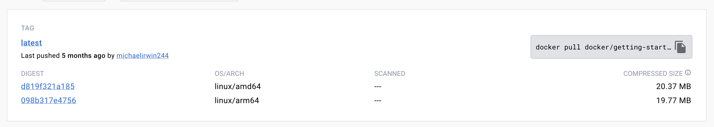

```{r setup, include=FALSE}
knitr::opts_chunk$set(echo = TRUE)
set.seed(1234)
```

# What is Docker?

ChatGPT says: *Docker is an open-source platform that allows you to automate the deployment and management of applications within software containers. It provides a way to package software and its dependencies into a standardized unit called a container. These containers are lightweight, portable, and self-sufficient, containing everything needed to run the application, including the code, runtime, system tools, libraries, and settings.*


## Install Docker

When working with virtual machines (VM) (think say Codespaces), a dockerfile is what defines our virtual environment and the tools (software) that we'll have in that environment. The systems that set-up your VM have docker installed.

But we can also use docker containers on our personal computers. That's what we'll do today.

<https://docs.docker.com/engine/install/>

# Let's run a container

So after you have Docker installed, you can run a container.

```         
docker run -d -p 80:80 docker/getting-started
```

-   `docker` call Docker
-   `run` run a container
-   `-d` in detached setting
-   `-p` use this port so `http://localhost:80` is how you open the application in a browser
-   `docker/getting-started` the name of the container on DockerHub

## First let's look at this on DockerHub

{width="800"}

Click on tags

{width="800"}

If you are on a Mac with an Apple chip (so M1, M2, etc), you need to check if there is `linux/arm64` listed. This means there is a version of the container that will work on your operating system. If you only see `linux/amd64`, you can try emulation but it might not work. To run in emulation mode, you add this to your `docker run` call: `--platform linux/amd64`. But your application might not work.

## Run the container

Open a terminal (or shell) window on your computer, and type or paste this in:

```         
docker run -d -p 80:80 docker/getting-started
```

The first time it'll download the container. Once it is done, we can see the running container in the Docker app.

## Let's look at the Docker app

{width="800"}

## Now we can open our app

Head to the browser and type

```         
http://localhost:80
```


